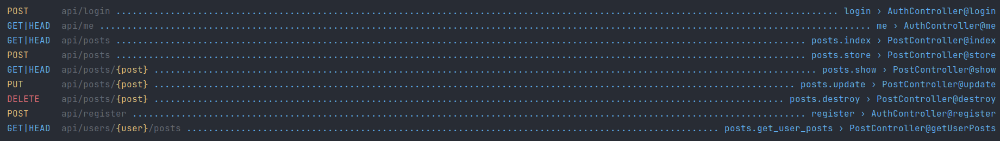

# Hexlet Webinar. Blog REST API

REST API with auth and posts CRUD functionality.

## Requirements
* Docker

## Install
```shell
make install
```

After install app will work on http://localhost:8000

## Routes

